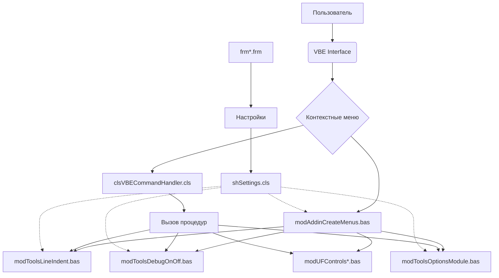

# Архитектурное описание проекта MACROTools

## Общая архитектура

MACROTools реализует модульную архитектуру, где каждая функциональность вынесена в отдельный модуль или класс. Это позволяет легко поддерживать и расширять функциональность аддина.

## Компонентная архитектура

### 1. Классы (Class/)
- **clsVBECommandHandler.cls**: Является центральным обработчиком событий команд VBE. Использует WithEvents для перехвата кликов по кнопкам меню.
- **shSettings.cls**: Рабочий лист для хранения настроек аддина.
- **ThisWB.cls**: Представляет собой класс для взаимодействия с текущей рабочей книгой.

### 2. Формы (Form/)
- **frmOptionsModule.frm**: Форма для настройки опций VBA (Option Explicit, Option Private Module и др.).
- **frmSettingsIndent.frm**: Форма для настройки параметров форматирования кода.

### 3. Модули (Module/)
#### Модули управления аддином:
- **modAddinConst.bas**: Хранит все константы проекта, включая названия меню и типы операций.
- **modAddinCreateMenus.bas**: Отвечает за создание и удаление контекстных меню в VBE.
- **modAddinInstall.bas**: Содержит процедуру установки аддина как надстройки Excel.
- **modAddinRibbonCallbacks.bas**: Callback-функции для элементов ленты Excel.

#### Модули вспомогательных функций:
- **modAddinPubFun.bas**: Глобальные публичные функции (работа с файлами, проверка открытости книг и др.).
- **modAddinPubFunVBE.bas**: Публичные функции для работы с VBE.

#### Модули инструментов:
- **modToolsDebugOnOff.bas**: Инструменты для включения/отключения отладочных сообщений.
- **modToolsLineIndent.bas**: Продвинутый инструмент форматирования отступов (реализация Smart Indenter).
- **modToolsOptionsModule.bas**: Инструменты для добавления опций VBA в модули.
- **modToolsLineNumbers.bas**: Инструменты для работы с номерами строк.
- **modToolsDimOneLine.bas**: Инструменты для преобразования объявлений переменных.
- **modToolsOther.bas**: Различные вспомогательные инструменты.
- **modToolsSwapEgual.bas**: Инструменты для замены местами выражений вокруг знака равенства.
- **modToolsDelTwoEmptyStrings.bas**: Инструменты для удаления двойных пустых строк.

#### Модули для работы с формами и контролами:
- **modUFControlsAlingHorizVert.bas**: Инструменты выравнивания контролов.
- **modUFControlsLowerUpperCase.bas**: Инструменты преобразования регистра текста в контролах.
- **modUFControlsMove.bas**: Инструменты для перемещения контролов.
- **modUFControlsReName.bas**: Инструменты для переименования контролов с обновлением кода.
- **modUFControlsStyleCopyPaste.bas**: Инструменты копирования и вставки стилей контролов.

## Архитектурные паттерны

### 1. Event-Driven Architecture
Команды в VBE обрабатываются через систему событий, где `clsVBECommandHandler` выступает в роли слушателя событий кнопок меню.

### 2. Configuration-Driven Architecture
Параметры форматирования и другие настройки хранятся на специальном листе Settings, что позволяет легко изменять поведение без изменения кода.

### 3. Modular Architecture
Каждая функция аддина изолирована в отдельный модуль, что облегчает сопровождение и тестирование.

## Потоки данных

### Управление меню
1. При запуске вызывается `Auto_Open()` в `modAddinCreateMenus.bas`
2. Создаются контекстные меню с помощью `AddContextMenus()`
3. Кнопки добавляются с помощью `AddButtom()`, которые связаны с обработчиком `clsVBECommandHandler`
4. При клике на кнопку вызывается соответствующая процедура

### Форматирование кода
1. Пользователь выбирает команду форматирования
2. Определяется область действия (весь проект или выбранный модуль)
3. Код читается из соответствующих модулей
4. Применяется алгоритм форматирования из `modToolsLineIndent.bas`
5. Форматированный код записывается обратно

### Работа с контролами
1. Пользователь выбирает контрол на форме
2. Вызывается соответствующая процедура (например, `RenameControl()`)
3. Если требуется, обновляется код, использующий контрол

## Технические ограничения и соображения

### Безопасность
- Все процедуры содержат обработку ошибок
- Проверяется доверие к источнику перед выполнением некоторых операций

### Совместимость
- Аддин использует стандартные COM-объекты и API VBE
- Поддерживает работу с различными версиями Excel

### Производительность
- Алгоритмы оптимизированы для работы с большими объемами кода
- Используются массивы для массовой обработки строк кода

## Расширяемость

Архитектура проекта позволяет легко добавлять новые функции:
1. Создание нового модуля с требуемой функциональностью
2. Добавление кнопки в соответствующее меню через `modAddinCreateMenus.bas`
3. Настройка обработки события в `clsVBECommandHandler.cls`

## Диаграмма архитектуры

Эта диаграмма показывает основные компоненты и их связи в архитектуре MACROTools.